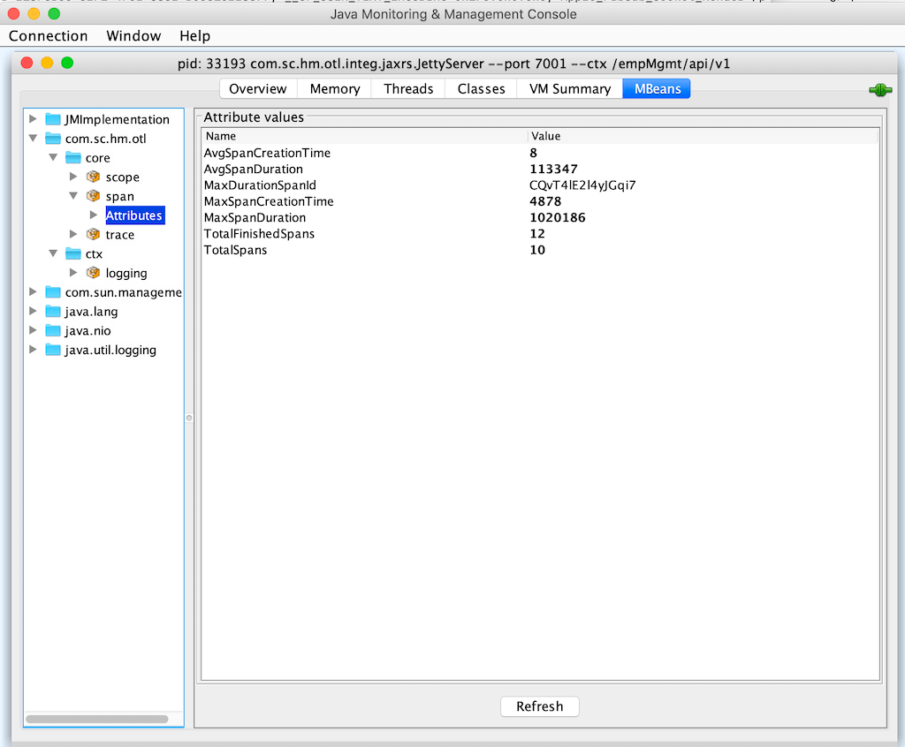
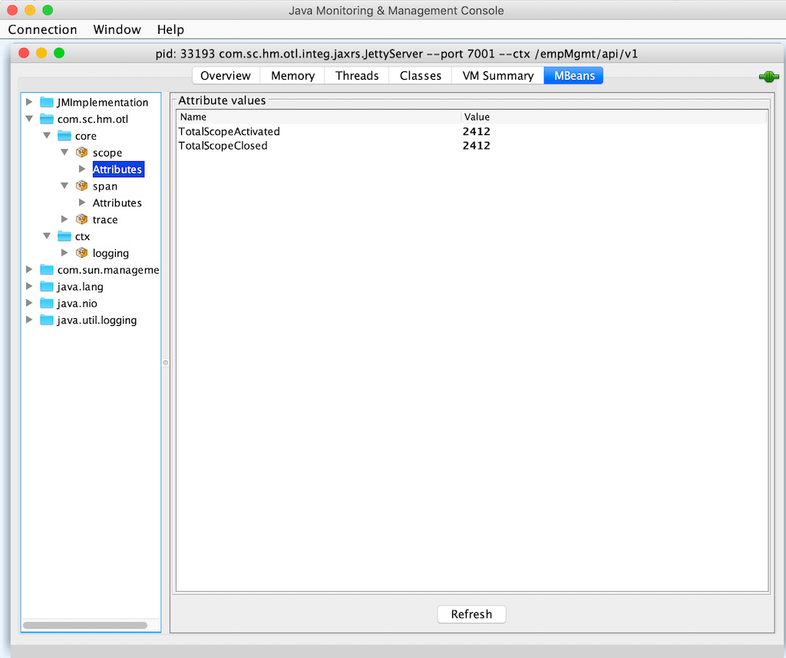

# OTL Metric

You can include otl-metric in your application, only if you wish to monitor your app by capturing various span metrics.

As of today, it captures the below set of metrics. Note that, Other category metrics are currently being built.

## Span 
1. Total Span - How many total span have been created since application startup
2. Average Span Creation Time - Monitor the overhead of span creation, by capturing create time
3. Max Span Creation Time - Find out the max time
4. Average Span duration - Monitor the workload by capturing the duration of every span
5. Max Span duration - Capture the span that took maaximum time to finish
6. Max Span Id - The id of the span that took time to complete
6. Total finished Span - Total number of spans that have finished so far

## Scope
1. Total number of Scope activated - A span mat or may not get activated. Only if it is activated, a scope will be created. Monitor the total number of activation happened
2. Total number of Scope closed - Total number of scope closed

## Tracer
1. Scope Manager - The name of the scope manager being used by this tracer
2. Propagation Registry - Registry name
3. Visitor - Span visitor

# How to configure

Include the otl-metrics library in your pom file. The OTL framework will automatically detect it and load the metric modules.

```
<dependencies>
    <dependency>
        <groupId>com.sc.hm.otl</groupId>
        <artifactId>otl-metrics</artifactId>
        <version>1.0-SNAPSHOT</version>
    </dependency>
<dependencies>

```


# MBean Snapshots




